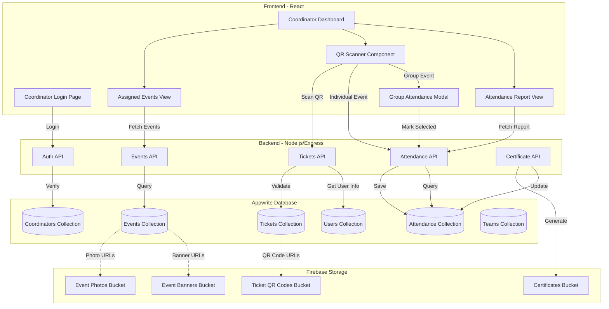
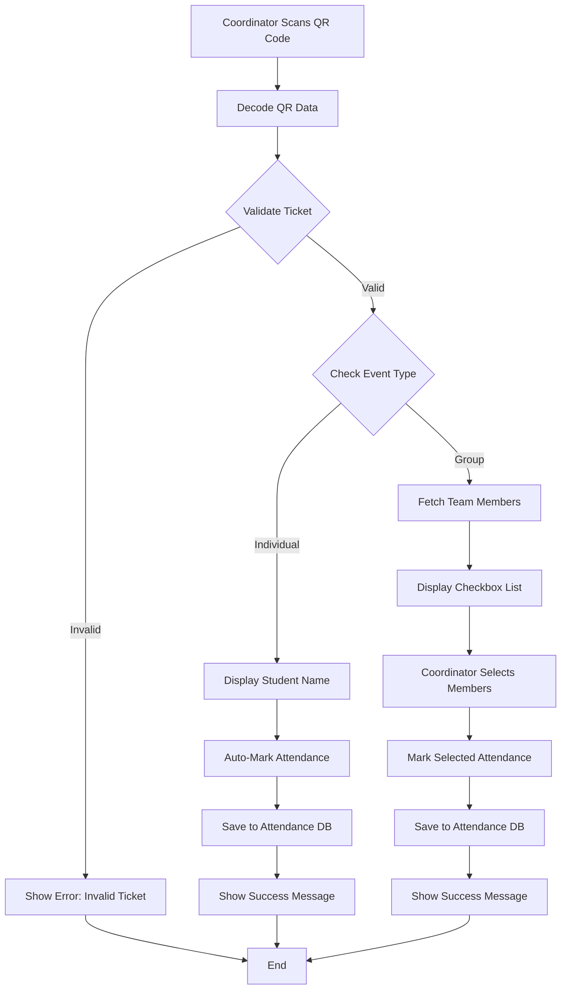

# 🎓 Brahma Fest - Event Coordinator System Architecture

> Complete system architecture for ASIET's Brahma Fest Event Management System

---

## System Overview

This document outlines the complete architecture for the Brahma Fest Event Coordinator system at ASIET, built with Node.js, React, Firebase Storage, and Appwrite Database.

---

## Coordinator Dashboard Flowchart


The above flowchart illustrates the complete coordinator workflow:
- **Login** → Access to coordinator dashboard
- **Three main sections**: Assigned Events, QR Scanner, Attendance Report
- **QR Scanner flow**: Validates tickets and marks attendance (with checkbox selection for group events)

---

## Architecture Diagram



---

## Database Schema

### Appwrite Collections

#### 1. **coordinators**
```json
{
  "coordinatorId": "string (unique)",
  "name": "string",
  "email": "string",
  "password": "string (hashed)",
  "phone": "string",
  "assignedEvents": ["eventId1", "eventId2"],
  "role": "coordinator | admin",
  "createdAt": "datetime"
}
```

#### 2. **events**
```json
{
  "eventId": "string (unique)",
  "eventName": "string",
  "eventType": "individual | group",
  "description": "string",
  "venue": "string",
  "date": "datetime",
  "startTime": "datetime",
  "endTime": "datetime",
  "maxParticipants": "number",
  "coordinatorId": "string",
  "bannerUrl": "string (Firebase URL)",
  "photoUrls": ["url1", "url2"],
  "certificateEnabled": "boolean",
  "status": "upcoming | ongoing | completed",
  "createdAt": "datetime"
}
```

#### 3. **tickets**
```json
{
  "ticketId": "string (unique)",
  "qrCode": "string (unique hash)",
  "qrCodeImageUrl": "string (Firebase URL)",
  "userId": "string",
  "eventId": "string",
  "teamId": "string | null",
  "ticketType": "individual | group",
  "status": "valid | used | invalid",
  "issuedAt": "datetime",
  "scannedAt": "datetime | null",
  "scannedBy": "string (coordinatorId) | null"
}
```

#### 4. **attendance**
```json
{
  "attendanceId": "string (unique)",
  "userId": "string",
  "eventId": "string",
  "teamId": "string | null",
  "ticketId": "string",
  "markedBy": "string (coordinatorId)",
  "markedAt": "datetime",
  "certificateGenerated": "boolean",
  "certificateUrl": "string (Firebase URL) | null",
  "certificateGeneratedAt": "datetime | null"
}
```

#### 5. **users**
```json
{
  "userId": "string (unique)",
  "name": "string",
  "email": "string",
  "phone": "string",
  "rollNumber": "string",
  "department": "string",
  "year": "number",
  "profilePicUrl": "string (Firebase URL) | null",
  "registeredEvents": ["eventId1", "eventId2"],
  "createdAt": "datetime"
}
```

#### 6. **teams**
```json
{
  "teamId": "string (unique)",
  "teamName": "string",
  "eventId": "string",
  "leaderId": "string (userId)",
  "members": [
    {
      "userId": "string",
      "name": "string",
      "attended": "boolean"
    }
  ],
  "ticketId": "string",
  "createdAt": "datetime"
}
```

---

## QR Scanner Flow



---

## Project Folder Structure

```
brahma-coordinator/
├── backend/
│   ├── src/
│   │   ├── config/
│   │   │   ├── appwrite.js          # Appwrite client setup
│   │   │   ├── firebase.js          # Firebase admin setup
│   │   │   └── env.js               # Environment variables
│   │   ├── controllers/
│   │   │   ├── authController.js    # Login/logout logic
│   │   │   ├── eventController.js   # Event CRUD operations
│   │   │   ├── ticketController.js  # QR validation logic
│   │   │   ├── attendanceController.js # Attendance marking
│   │   │   └── certificateController.js # Certificate generation
│   │   ├── routes/
│   │   │   ├── auth.js
│   │   │   ├── events.js
│   │   │   ├── tickets.js
│   │   │   ├── attendance.js
│   │   │   └── certificates.js
│   │   ├── middleware/
│   │   │   ├── authMiddleware.js    # JWT verification
│   │   │   └── errorHandler.js      # Error handling
│   │   ├── services/
│   │   │   ├── qrService.js         # QR code generation/validation
│   │   │   ├── certificateService.js # PDF generation
│   │   │   └── storageService.js    # Firebase storage operations
│   │   ├── utils/
│   │   │   ├── validators.js        # Input validation
│   │   │   └── helpers.js           # Helper functions
│   │   └── server.js                # Express app entry point
│   ├── package.json
│   └── .env
│
├── frontend/
│   ├── public/
│   │   └── index.html
│   ├── src/
│   │   ├── components/
│   │   │   ├── Login/
│   │   │   │   └── CoordinatorLogin.jsx
│   │   │   ├── Dashboard/
│   │   │   │   ├── Dashboard.jsx
│   │   │   │   ├── Sidebar.jsx
│   │   │   │   └── Header.jsx
│   │   │   ├── Events/
│   │   │   │   ├── AssignedEvents.jsx
│   │   │   │   └── EventCard.jsx
│   │   │   ├── Scanner/
│   │   │   │   ├── QRScanner.jsx
│   │   │   │   ├── ScanResult.jsx
│   │   │   │   └── GroupAttendanceModal.jsx
│   │   │   ├── Reports/
│   │   │   │   ├── AttendanceReport.jsx
│   │   │   │   └── ReportTable.jsx
│   │   │   └── Common/
│   │   │       ├── Loader.jsx
│   │   │       ├── ErrorMessage.jsx
│   │   │       └── SuccessMessage.jsx
│   │   ├── services/
│   │   │   ├── api.js               # Axios instance
│   │   │   ├── authService.js       # Auth API calls
│   │   │   ├── eventService.js      # Event API calls
│   │   │   ├── ticketService.js     # Ticket API calls
│   │   │   └── attendanceService.js # Attendance API calls
│   │   ├── context/
│   │   │   └── AuthContext.jsx      # Global auth state
│   │   ├── hooks/
│   │   │   ├── useAuth.js
│   │   │   └── useQRScanner.js
│   │   ├── utils/
│   │   │   ├── constants.js
│   │   │   └── helpers.js
│   │   ├── styles/
│   │   │   ├── global.css
│   │   │   └── components/
│   │   ├── App.jsx
│   │   └── main.jsx
│   ├── package.json
│   └── .env
│
└── README.md
```

---

## API Endpoints

### Authentication
- `POST /api/auth/login` - Coordinator login
- `POST /api/auth/logout` - Coordinator logout
- `GET /api/auth/verify` - Verify JWT token

### Events
- `GET /api/events/assigned/:coordinatorId` - Get assigned events
- `GET /api/events/:eventId` - Get event details

### Tickets
- `POST /api/tickets/validate` - Validate QR code
- `GET /api/tickets/:ticketId` - Get ticket details
- `GET /api/tickets/team/:teamId` - Get team members for group events

### Attendance
- `POST /api/attendance/mark` - Mark attendance (individual)
- `POST /api/attendance/mark-group` - Mark group attendance
- `GET /api/attendance/report/:eventId` - Get attendance report
- `GET /api/attendance/export/:eventId` - Export attendance as CSV

### Certificates
- `POST /api/certificates/generate` - Generate certificate
- `GET /api/certificates/:userId/:eventId` - Get certificate URL

---

## Technology Stack

### Frontend
- **React** 18+ with Vite
- **React Router** for navigation
- **Axios** for API calls
- **html5-qrcode** for QR scanning
- **Tailwind CSS** for styling
- **React Context API** for state management

### Backend
- **Node.js** 18+
- **Express.js** for REST API
- **Appwrite SDK** for database operations
- **Firebase Admin SDK** for storage
- **jsonwebtoken** for authentication
- **qrcode** for QR generation
- **pdfkit** for certificate generation

### Databases & Storage
- **Appwrite** - Primary database for all collections
- **Firebase Storage** - Image and file storage

---

## Key Features

### QR Scanner Functionality
1. **Individual Events**
   - Scan QR → Validate ticket
   - Display student name and details
   - Auto-mark attendance
   - Show success confirmation

2. **Group Events**
   - Scan QR → Validate team ticket
   - Display team name and all members
   - Show checkbox list
   - Coordinator selects attended members
   - Mark attendance only for selected
   - Generate certificates only for attended members

### Attendance Report
- View all attendees for assigned events
- Filter by event, date, status
- Export to CSV/Excel
- Real-time updates

### Security
- JWT-based authentication
- Role-based access control
- QR code encryption
- One-time ticket validation

---

## Next Steps

1. Set up Appwrite project and create collections
2. Set up Firebase project and storage buckets
3. Initialize Node.js backend with Express
4. Initialize React frontend with Vite
5. Implement authentication flow
6. Build QR scanner component
7. Implement attendance marking logic
8. Create attendance reports
9. Add certificate generation
10. Deploy and test

---

> **Built for Brahma Fest 2025 - ASIET**
