# 🎓 Brahma Fest - Event Coordinator System Architecture

> Complete system architecture for ASIET's Brahma Fest Event Management System

---

## System Overview

This document outlines the complete architecture for the Brahma Fest Event Coordinator system at ASIET, built with Node.js, React, Firebase Storage, and Appwrite Database.

---

## Coordinator Dashboard Flowchart


The above flowchart illustrates the complete coordinator workflow:
- **Login** → Access to coordinator dashboard
- **Three main sections**: Assigned Events, QR Scanner, Attendance Report
- **QR Scanner flow**: Validates tickets and marks attendance (with checkbox selection for group events)

---

## Architecture Diagram


---

## Database Schema

### Appwrite Collections

#### 1. **coordinators**
```json
{
  "coordinatorId": "string (unique)",
  "name": "string",
  "email": "string",
  "password": "string (hashed)",
  "phone": "string",
  "assignedEvents": ["eventId1", "eventId2"],
  "role": "coordinator | admin",
  "createdAt": "datetime"
}
```

#### 2. **events**
```json
{
  "eventId": "string (unique)",
  "eventName": "string",
  "eventType": "individual | group",
  "description": "string",
  "venue": "string",
  "date": "datetime",
  "startTime": "datetime",
  "endTime": "datetime",
  "maxParticipants": "number",
  "coordinatorId": "string",
  "bannerUrl": "string (Firebase URL)",
  "photoUrls": ["url1", "url2"],
  "certificateEnabled": "boolean",
  "status": "upcoming | ongoing | completed",
  "createdAt": "datetime"
}
```

### Database Collections

#### Tickets Collection
```javascript
{
  T_id: string (primary key, ticket ID),
  S_name: string (student name),
  E_name: string (event name),
  Time: timestamp (registration/generation time),
  Usage: boolean (true = already used, false = available)
}
```

**Validation Logic:**
- When QR is scanned, check if ticket exists
- If `Usage === true` → Ticket already used
- If ticket not found in current event → "Not in the present event"
- If `Usage === false` → Valid ticket, mark as used and allow entry

#### Events Collection
```javascript
{
  E_id: string (primary key, event ID),
  E_name: string (event name),
  E_pass: string (coordinator password/access code)
}
```

**Purpose:**
- Serves as coordinator authentication
- Coordinators login using `E_id` and `E_pass`
- Holds only particular event data based on credentials
- Each event has unique access credentials

#### Student_Participants Collection
```javascript
{
  studentId: string (primary key),
  S_name: string (student name),
  email: string,
  phone: string,
  department: string,
  year: number,
  registeredEvents: array<string> (event IDs)
}
```

**Purpose:**
- Referenced when QR check returns false
- Stores student details for all participants
- Links students to their registered events
#### 4. **attendance**
```json
{
  "attendanceId": "string (unique)",
  "userId": "string",
  "eventId": "string",
  "teamId": "string | null",
  "ticketId": "string",
  "markedBy": "string (coordinatorId)",
  "markedAt": "datetime",
  "certificateGenerated": "boolean",
  "certificateUrl": "string (Firebase URL) | null",
  "certificateGeneratedAt": "datetime | null"
}
```

#### 6. **teams**
```json
{
  "teamId": "string (unique)",
  "teamName": "string",
  "eventId": "string",
  "leaderId": "string (userId)",
  "members": [
    {
      "userId": "string",
      "name": "string",
      "attended": "boolean"
    }
  ],
  "ticketId": "string",
  "createdAt": "datetime"
}
```

---

## QR Scanner Flow

```mermaid
flowchart TD
    Start[Coordinator Scans QR Code] --> Decode[Decode QR Data: T_id]
    Decode --> CheckTicket{Check Ticket in<br/>Tickets Collection}
    
    CheckTicket -->|Not Found| NotInEvent[Error: Not in Present Event]
    CheckTicket -->|Found| CheckUsage{Check Usage Field}
    
    CheckUsage -->|Usage = true| AlreadyUsed[Error: Ticket Already Used]
    CheckUsage -->|Usage = false| ValidTicket[Valid Ticket ✓]
    
    ValidTicket --> FetchStudent[Fetch Student Details<br/>from Student_Participants]
    FetchStudent --> DisplayInfo[Display: S_name, Event Details]
    DisplayInfo --> MarkAttendance[Mark Attendance]
    MarkAttendance --> UpdateUsage[Update Usage = true]
    UpdateUsage --> Success[Success: Entry Granted]
    
    NotInEvent --> End[End]
    AlreadyUsed --> End
    Success --> End
    
    style ValidTicket fill:#90EE90
    style AlreadyUsed fill:#FFB6C1
    style NotInEvent fill:#FFB6C1
    style Success fill:#90EE90
```



### QR Validation Logic

Based on the whiteboard design, the validation follows this sequence:

1. **Scan QR Code** → Extract `T_id`
2. **Query Tickets Collection** using `T_id`
3. **Check Existence**:
   - If ticket not found → **"Not in the present event"**
   - If ticket found → Proceed to step 4
4. **Check Usage Field**:
   - If `Usage === true` → **"Ticket already used"**
   - If `Usage === false` → Valid ticket, proceed
5. **Fetch Student Details** from `Student_Participants` using `S_name`
6. **Display Information** and confirm entry
7. **Mark Attendance** and **Update `Usage = true`**


---

## Project Folder Structure

```
brahma-coordinator/
├── backend/
│   ├── src/
│   │   ├── config/
│   │   │   ├── appwrite.js          # Appwrite client setup
│   │   │   ├── firebase.js          # Firebase admin setup
│   │   │   └── env.js               # Environment variables
│   │   ├── controllers/
│   │   │   ├── authController.js    # Login/logout logic
│   │   │   ├── eventController.js   # Event CRUD operations
│   │   │   ├── ticketController.js  # QR validation logic
│   │   │   ├── attendanceController.js # Attendance marking
│   │   │   └── certificateController.js # Certificate generation
│   │   ├── routes/
│   │   │   ├── auth.js
│   │   │   ├── events.js
│   │   │   ├── tickets.js
│   │   │   ├── attendance.js
│   │   │   └── certificates.js
│   │   ├── middleware/
│   │   │   ├── authMiddleware.js    # JWT verification
│   │   │   └── errorHandler.js      # Error handling
│   │   ├── services/
│   │   │   ├── qrService.js         # QR code generation/validation
│   │   │   ├── certificateService.js # PDF generation
│   │   │   └── storageService.js    # Firebase storage operations
│   │   ├── utils/
│   │   │   ├── validators.js        # Input validation
│   │   │   └── helpers.js           # Helper functions
│   │   └── server.js                # Express app entry point
│   ├── package.json
│   └── .env
│
├── frontend/
│   ├── public/
│   │   └── index.html
│   ├── src/
│   │   ├── components/
│   │   │   ├── Login/
│   │   │   │   └── CoordinatorLogin.jsx
│   │   │   ├── Dashboard/
│   │   │   │   ├── Dashboard.jsx
│   │   │   │   ├── Sidebar.jsx
│   │   │   │   └── Header.jsx
│   │   │   ├── Events/
│   │   │   │   ├── AssignedEvents.jsx
│   │   │   │   └── EventCard.jsx
│   │   │   ├── Scanner/
│   │   │   │   ├── QRScanner.jsx
│   │   │   │   ├── ScanResult.jsx
│   │   │   │   └── GroupAttendanceModal.jsx
│   │   │   ├── Reports/
│   │   │   │   ├── AttendanceReport.jsx
│   │   │   │   └── ReportTable.jsx
│   │   │   └── Common/
│   │   │       ├── Loader.jsx
│   │   │       ├── ErrorMessage.jsx
│   │   │       └── SuccessMessage.jsx
│   │   ├── services/
│   │   │   ├── api.js               # Axios instance
│   │   │   ├── authService.js       # Auth API calls
│   │   │   ├── eventService.js      # Event API calls
│   │   │   ├── ticketService.js     # Ticket API calls
│   │   │   └── attendanceService.js # Attendance API calls
│   │   ├── context/
│   │   │   └── AuthContext.jsx      # Global auth state
│   │   ├── hooks/
│   │   │   ├── useAuth.js
│   │   │   └── useQRScanner.js
│   │   ├── utils/
│   │   │   ├── constants.js
│   │   │   └── helpers.js
│   │   ├── styles/
│   │   │   ├── global.css
│   │   │   └── components/
│   │   ├── App.jsx
│   │   └── main.jsx
│   ├── package.json
│   └── .env
│
└── README.md
```

---

## API Endpoints

### Authentication
- `POST /api/auth/login` - Coordinator login using `E_id` and `E_pass`
  ```json
  Request: { "E_id": "string", "E_pass": "string" }
  Response: { "token": "jwt", "eventDetails": {...} }
  ```
- `POST /api/auth/logout` - Coordinator logout
- `GET /api/auth/verify` - Verify JWT token

### Events
- `GET /api/events/:E_id` - Get event details by E_id
- `GET /api/events/:E_id/tickets` - Get all tickets for an event

### Tickets
- `POST /api/tickets/validate` - Validate QR code using T_id
  ```json
  Request: { "T_id": "string", "E_id": "string" }
  Response: 
    Success: { "valid": true, "S_name": "string", "E_name": "string", "Usage": false }
    Already Used: { "valid": false, "error": "Ticket already used" }
    Not Found: { "valid": false, "error": "Not in the present event" }
  ```
- `GET /api/tickets/:T_id` - Get ticket details
- `PUT /api/tickets/:T_id/mark-used` - Mark ticket as used (Usage = true)

### Attendance
- `POST /api/attendance/mark` - Mark attendance (individual)
- `POST /api/attendance/mark-group` - Mark group attendance
- `GET /api/attendance/report/:eventId` - Get attendance report
- `GET /api/attendance/export/:eventId` - Export attendance as CSV

### Certificates
- `POST /api/certificates/generate` - Generate certificate
- `GET /api/certificates/:userId/:eventId` - Get certificate URL

---

## Technology Stack

### Frontend
- **React** 18+ with Vite
- **React Router** for navigation
- **Axios** for API calls
- **html5-qrcode** for QR scanning
- **Tailwind CSS** for styling
- **React Context API** for state management

### Backend
- **Node.js** 18+
- **Express.js** for REST API
- **Appwrite SDK** for database operations
- **Firebase Admin SDK** for storage
- **jsonwebtoken** for authentication
- **qrcode** for QR generation
- **pdfkit** for certificate generation

### Databases & Storage
- **Appwrite** - Primary database for all collections
- **Firebase Storage** - Image and file storage

---

## Key Features

### QR Scanner Functionality
1. **Individual Events**
   - Scan QR → Validate ticket
   - Display student name and details
   - Auto-mark attendance
   - Show success confirmation

2. **Group Events**
   - Scan QR → Validate team ticket
   - Display team name and all members
   - Show checkbox list
   - Coordinator selects attended members
   - Mark attendance only for selected
   - Generate certificates only for attended members

### Attendance Report
- View all attendees for assigned events
- Filter by event, date, status
- Export to CSV/Excel
- Real-time updates

### Security
- JWT-based authentication
- Role-based access control
- QR code encryption
- One-time ticket validation

---

## Next Steps

1. Set up Appwrite project and create collections
2. Set up Firebase project and storage buckets
3. Initialize Node.js backend with Express
4. Initialize React frontend with Vite
5. Implement authentication flow
6. Build QR scanner component
7. Implement attendance marking logic
8. Create attendance reports
9. Add certificate generation
10. Deploy and test

---

> **Built for Brahma Fest 2025 - ASIET**
